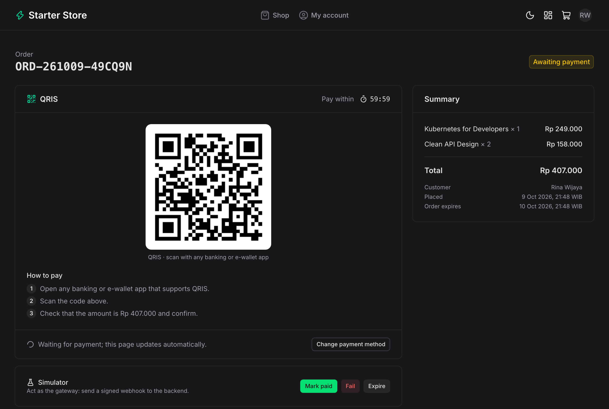
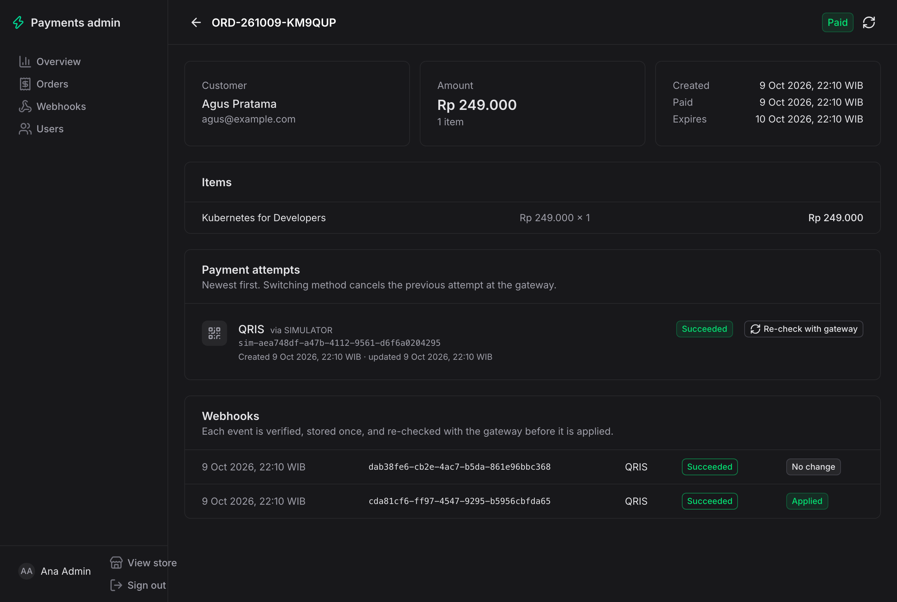
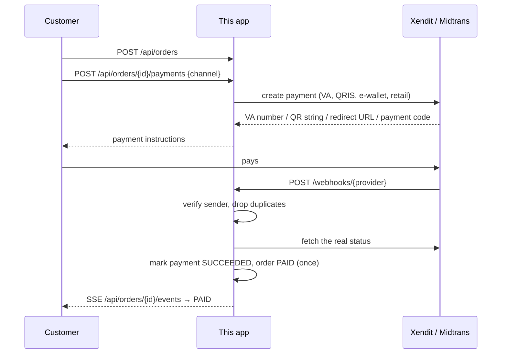

# Payment Gateway Starter

**Live demo:** [payment-gateway-starter-web.vercel.app](https://payment-gateway-starter-web.vercel.app) · **API:** [payment-gateway-starter.vercel.app](https://payment-gateway-starter.vercel.app/api/channels) · **API docs:** [Swagger UI](https://payment-gateway-starter.vercel.app/swagger-ui.html) ([OpenAPI JSON](https://payment-gateway-starter.vercel.app/v3/api-docs)) · **Web repo:** [payment-gateway-starter-web](https://github.com/Mauludinegi/payment-gateway-starter-web)

Sandbox demo, no real money: the demo routes payments to the Midtrans sandbox and a Xendit test key. `GET /api/environment` reports whether every gateway in use has test credentials, and the store shows its sandbox banner only when it does. What was actually tried against the gateways is listed under [Tested against the gateways](#tested-against-the-gateways).

A Spring Boot backend for taking Indonesian payments (virtual accounts, QRIS, e-wallets, and retail outlets) through **Xendit** or **Midtrans**. It handles the parts that usually go wrong in production: duplicate webhooks, forged webhooks, late payments, customers who switch payment methods, and payments that expire.

Customers sign in with **Google** (Firebase Authentication); sessions live in **Redis** (Upstash), and checkout, the payment page, and order history require a session. Admins manage the catalogue (product images in **Supabase Storage**, stock that is held at checkout), and customers who paid can rate what they bought.

It runs with zero setup: a built-in **simulator** gateway stands in for the real ones and a dev sign-in stands in for Google, so you can click through the whole checkout before you have any keys.

The storefront and admin dashboard live in a separate repo: **[payment-gateway-starter-web](https://github.com/Mauludinegi/payment-gateway-starter-web)** (Nuxt 4 + Nuxt UI).

<table>
  <tr>
    <td></td>
    <td></td>
  </tr>
</table>

## Quick start

Requires Java 21+.

```bash
./mvnw spring-boot:run
```

The API is on http://localhost:8080. For the store and admin UI, run the [web app](https://github.com/Mauludinegi/payment-gateway-starter-web) next to it, or try the API directly:

```bash
AUTH="authorization: Bearer $(curl -s localhost:8080/api/auth/dev -H 'content-type: application/json' \
  -d '{"name":"Budi","email":"budi@example.com"}' | jq -r .token)"
ORDER=$(curl -s localhost:8080/api/orders -H "$AUTH" -H 'content-type: application/json' \
  -d '{"items":[{"productId":"course-k8s","quantity":1}]}' | jq -r .id)
curl -s localhost:8080/api/orders/$ORDER/payments -H "$AUTH" -H 'content-type: application/json' -d '{"channel":"BCA_VA"}'
curl -s -X POST localhost:8080/api/simulator/orders/$ORDER/pay      # the simulator sends a signed webhook
curl -s localhost:8080/api/orders/$ORDER -H "$AUTH" | jq .status   # "PAID"
```

With your own services (Postgres such as Supabase, Upstash Redis, Firebase), put them in `.env` and run with the `local` profile, which reads that file:

```bash
cp .env.example .env   # fill in what you use
./mvnw spring-boot:run -Dspring-boot.run.profiles=local
```

Or run PostgreSQL in Docker:

```bash
docker compose up --build
```

### Accounts and sessions

1. The web app signs the customer in with Google through Firebase and sends the Firebase ID token to `POST /api/auth/google`.
2. The backend verifies the token against Google's public keys (RS256, audience and issuer bound to `FIREBASE_PROJECT_ID`, not expired). No service account is needed.
3. It creates or updates the user and returns an opaque session token. Redis stores only the token's SHA-256 with a TTL (`AUTH_SESSION_TTL`, 7 days by default), so a Redis dump cannot be replayed as a login.
4. Customer endpoints take `Authorization: Bearer <session>`. Customers see only their own orders; someone else's order returns `404`.

### Roles

Every account is a `CUSTOMER` or an `ADMIN`, stored in `users.role`. The admin API loads the role from the database on each request, so a change applies right away without signing in again.

- Accounts listed in `ADMIN_EMAILS` become admins when they sign in with Google (verified email only). Locally, the dev sign-in does the same for `AUTH_DEV_ADMIN_EMAILS` (`admin@example.com` by default).
- Admins promote or demote others in the dashboard (`PATCH /api/admin/users/{id}/role`). Nobody can change their own role, so there is always an admin left, and the lists never demote anyone.

Without `UPSTASH_REDIS_REST_URL`, sessions are kept in memory (single instance, lost on restart). `POST /api/auth/dev` signs in with just a name and email for local runs; it is on by default and must be turned off with `AUTH_DEV_LOGIN_ENABLED=false` in production.

**Supabase:** use the session pooler (`aws-0-<region>.pooler.supabase.com:5432`, user `postgres.<project-ref>`), because the direct `db.<ref>.supabase.co` host is IPv6-only. Tables go in `public` (change it with `DATABASE_SCHEMA`). Supabase serves `public` through its Data API, so after every migration Flyway turns on row level security for all app tables (`db/callback/postgresql/afterMigrate.sql`). With no policies, the anon and authenticated keys get nothing, while the app, which owns the tables, works as usual.

### Products, stock, and reviews

- **Products** are managed at `/api/admin/products`. The ID is fixed once created because orders refer to it; products are hidden rather than deleted.
- **Images** (JPEG, PNG, or WebP, up to 2 MB, checked by their bytes rather than the file name) go to the public Supabase Storage bucket `SUPABASE_STORAGE_BUCKET` (`product-images`, created on the first upload). Use the project's secret key (`sb_secret_…`) or the legacy `service_role` key; it stays on the server. Without Supabase settings, images are saved under `MEDIA_DIR` and served at `/api/media/products/…`. Every upload gets a new name, so images can be cached for a year.
- **Stock** is optional: empty means unlimited. Placing an order takes the stock in the same transaction, with a conditional update so two buyers cannot get the last unit, and returns `409` when there is not enough. An order that expires unpaid gives its stock back. If a payment arrives after that and the units are gone, the order is still paid and flagged for the admin (`stockShort`).
- **Reviews:** customers with a paid order for a product can give it 1 to 5 stars and an optional comment, one review per product, which they can edit or delete. Other shoppers see only a first name and last initial. Admins can hide a review; hidden reviews leave the average, and the author is told.
- **The catalogue is cached** in Redis (Upstash) for 10 minutes and cleared after every change to products, stock, or reviews commits. If Redis is down, the database answers. Checkout always reads stock and prices from the database, never from the cache. Keep the Upstash database in the same region as the API and Postgres, or the cache is slower than the database.

## What it does



### Channels

| Kind | Xendit | Midtrans |
| --- | --- | --- |
| Virtual account | BCA, BNI, BRI, Mandiri, Permata, BSI, Bank Sahabat Sampoerna | BCA, BNI, BRI, Mandiri, Permata |
| QR | QRIS | QRIS |
| E-wallet | OVO, DANA, ShopeePay, LinkAja | GoPay, ShopeePay |
| Retail outlet | Indomaret, Alfamart | Indomaret, Alfamart |

Each channel goes to the default provider unless you route it somewhere else, so you can mix gateways:

```yaml
payments:
  default-provider: XENDIT
  routing:
    GOPAY: MIDTRANS
```

Or with environment variables, e.g. Midtrans for everything except the channels only Xendit has:

```bash
PAYMENTS_DEFAULT_PROVIDER=MIDTRANS
PAYMENTS_ROUTES=DANA:XENDIT,OVO:XENDIT,LINKAJA:XENDIT,BSI_VA:XENDIT,BSS_VA:XENDIT
```

Checkout only offers channels whose gateway has keys and supports them, and a typo in `PAYMENTS_ROUTES` stops the app at startup. Some channels, such as Bank Sahabat Sampoerna, must also be activated in the gateway's dashboard first.

### API

Interactive docs are at `/swagger-ui.html` (OpenAPI JSON at `/v3/api-docs`). For signed-in endpoints, click Authorize and paste the session token.

| Method | Path | Notes |
| --- | --- | --- |
| `GET` | `/api/products` | Active products with `stock` (null = unlimited), `imageUrl`, `rating`, and `reviewCount` (cached) |
| `GET` | `/api/products/{id}` | One active product |
| `GET` | `/api/products/{id}/reviews?page=&size=` | Visible reviews, newest first |
| `GET` | `/api/channels` | Channels whose gateway is configured |
| `GET` | `/api/environment` | `{sandbox, testMode}`: `sandbox` is true only when every gateway in use has test credentials |
| `GET` | `/api/auth/options` | Which sign-in methods are enabled |
| `POST` | `/api/auth/google` | `{idToken}` from Firebase; returns `{token, expiresAt, user}` |
| `POST` | `/api/auth/dev` | `{name, email}`; local runs only |
| `GET` | `/api/auth/me` | Signed-in user (session) |
| `DELETE` | `/api/auth/session` | Sign out; revokes the session |
| `POST` | `/api/orders` | `{items: [{productId, quantity}], customerName?}` (session); prices come from the catalogue, the customer's email from the account |
| `GET` | `/api/orders/{id}` | Order with items, its latest payment, and instructions (session) |
| `GET` | `/api/orders/{id}/events` | Server-Sent Events: an `order` event now and on every change, until it is paid or expired (session) |
| `POST` | `/api/orders/{id}/payments` | `{channel, mobileNumber?}` (session); `mobileNumber` (`+62…`) is required for OVO. Send an `Idempotency-Key` header (up to 64 letters, digits, `-`, `_`) and reuse it on retries. `201` with instructions, or `202` with `payment.confirming: true` when the gateway did not answer in time |
| `GET` | `/api/me/orders` | The customer's 50 latest orders (session) |
| `GET` | `/api/me/reviews/{productId}` | `{canReview, review, hidden}` for the signed-in customer (session) |
| `PUT` | `/api/me/reviews/{productId}` | `{rating: 1-5, comment?}`; only after a paid order for it (session) |
| `DELETE` | `/api/me/reviews/{productId}` | Delete your review (session) |
| `GET` | `/api/media/products/{file}` | Product images when Supabase Storage is not configured |
| `POST` | `/webhooks/{xendit\|midtrans}` | Gateway notifications |
| `POST` | `/api/simulator/orders/{id}/{pay\|fail\|expire}` | Simulator only; disable in production |

(session) needs `Authorization: Bearer <session token>`.

Admin endpoints need the session of an `ADMIN` account (`401` without a session, `403` for customers):

| Method | Path | Notes |
| --- | --- | --- |
| `GET` | `/api/admin/stats` | Revenue, conversion, last 7 days, payments by method, orders paid twice |
| `GET` | `/api/admin/orders?status=&q=&page=&size=` | Search by reference, name, or email |
| `GET` | `/api/admin/orders/{id}` | Items, every payment attempt, and its webhooks |
| `GET` | `/api/admin/webhooks?page=&size=` | Every verified event with the confirmed status and outcome; `queued` while it waits for its payment |
| `POST` | `/api/admin/payments/{id}/sync` | Re-check one payment with its gateway, for a missed webhook |
| `GET` | `/api/admin/users?role=&q=&page=&size=` | Accounts with their orders and amount spent |
| `PATCH` | `/api/admin/users/{id}/role` | `{role: CUSTOMER\|ADMIN}`; not for your own account |
| `GET` | `/api/admin/products` | Every product, including hidden ones, with `version` |
| `POST` | `/api/admin/products` | `{id, name, description, category, icon, price, active, sortOrder, stock}` |
| `PUT` | `/api/admin/products/{id}` | Same fields plus the `version` you loaded; `409` if it changed since, for example because an order took stock |
| `PUT` | `/api/admin/products/{id}/image` | Multipart `file` |
| `DELETE` | `/api/admin/products/{id}/image` | Back to the icon |
| `GET` | `/api/admin/reviews?productId=&hidden=&page=&size=` | Reviews with the author's email |
| `PATCH` | `/api/admin/reviews/{id}` | `{hidden: true\|false}` |

Errors are returned as [RFC 9457](https://www.rfc-editor.org/rfc/rfc9457) problem details (`404`, `400`, `409` for an order that is already paid or expired, for a new payment while the previous one is still being confirmed with the gateway, for stock that ran out, or for a product edited since you loaded it, `401` for a missing session or a webhook that fails verification, `403` for a customer on the admin API, `502` when the gateway or the image storage rejects a request).

## Design decisions

- **Starting a payment survives double clicks and timeouts.** The order row is locked while the attempt is recorded, and the attempt is saved before the gateway is called, so its id (Xendit `reference_id`, Midtrans `order_id`) exists before any webhook can arrive. The same `Idempotency-Key` returns the first attempt instead of starting another. A timeout, connection error, or gateway 5xx does not mark the payment failed: it stays `PENDING` and "confirming", new methods are refused with `409` meanwhile, and `PaymentReconciler` (run with the expiry job) retries the create. Midtrans rejects a second charge for the same `order_id`, so the retry reads the first one back (VA and retail codes; a QR or e-wallet charge is expired instead and the customer picks again). Xendit's v3 API neither deduplicates nor looks up by `reference_id`, so a retry creates a second payment request; the first was never shown to the customer and expires unpaid. OVO is the exception (Xendit pushes it to the customer's phone), so it is never retried and is settled by its webhook or by expiry. Only a clear rejection (4xx) marks a payment failed.
- **Webhooks are verified, deduplicated, re-checked, and never dropped.** Xendit webhooks must carry the account's `x-callback-token`; Midtrans notifications must carry a valid SHA-512 `signature_key`. Each event is stored in `webhook_events` under a unique `(provider, event_key)`, so a retried delivery is acknowledged without being applied twice; any other database error fails the request so the gateway retries. The payload is then treated only as a hint: the app asks the gateway for the payment's current status and applies that. A verified event that matches no payment yet is stored as queued and replayed on every run of the background job, for up to 3 days.
- **Statuses only move forward.** A succeeded payment is never downgraded by a late `failed` or `expired` event, and a final status is never overwritten. The order becomes `PAID` exactly once, and `OrderPaidEvent` is published once, after the transaction commits `ReceiptNotifier` only logs it: no receipt email is sent. That listener is where to send one or fulfil the order.
- **Late payments still count.** If a customer switches from a VA to QRIS but then pays the old VA anyway, the money arrived, so the order is marked paid.
- **Switching methods cancels the old one.** Starting a new payment cancels any pending attempt at the gateway (best effort), so customers don't end up with two live payment codes.
- **Expiry closes the payment at the gateway first.** A scheduled job takes payments past their expiry (with a 2-minute grace period), asks the gateway for the status, and if it is still open cancels it there (Xendit cancel, Midtrans expire) and checks again. Only once the gateway reports it closed is it marked expired here; if the gateway still reports it open, nothing changes and the job tries again on its next run. Orders expire, and their stock is released, only when no payment is pending. Orders expire after 24 hours by default; each payment after 1 hour. A payment that was never confirmed is closed 15 minutes after its expiry, since the gateway was given the same expiry.
- **Concurrency.** Entities use optimistic locking (`@Version`), so a webhook and the expiry job racing on the same payment cannot both win. Requests run on virtual threads.
- **The server prices every order.** The client sends product IDs and quantities only; names and prices are copied into `order_items`, so later catalogue edits never change a placed order.
- **Double payments are visible.** If an old method is paid after the customer switched and paid the new one, the order stays paid once and the admin API flags it for a refund.
- **The payment page is pushed, not polled.** Status changes publish `OrderChangedEvent`; after the transaction commits, `OrderEventHub` sends the order to its open SSE streams on another thread, so a slow browser never delays a webhook. Streams are kept per instance with a heartbeat every 25 seconds and closed on shutdown; with several instances the web app's fallback polling covers pages connected elsewhere (or publish the event over Redis pub/sub).
- **Gateways sit behind one interface.** `PaymentGateway` has `create`, `fetchStatus`, `cancel`, and `parseWebhook`. Adding another provider means one new class; checkout and webhook handling stay the same.

## Connecting a real gateway

Webhooks need a public URL. For local testing, expose port 8080 with a tunnel such as `cloudflared tunnel --url http://localhost:8080` or `ngrok http 8080`.

### Xendit (test mode)

1. In the Xendit dashboard (test mode), copy the secret API key and the webhook verification token.
2. Set `XENDIT_SECRET_KEY`, `XENDIT_CALLBACK_TOKEN`, and `PAYMENTS_DEFAULT_PROVIDER=XENDIT`.
3. Under webhook settings, point the Payments API notifications (`payment.capture`, `payment.failure`) to `https://<your-host>/webhooks/xendit`.

This uses the [Payments API v3](https://docs.xendit.co/apidocs/create-payment-request) (`POST /v3/payment_requests`). Required `channel_properties` vary by channel and change over time, so check them in Xendit's Channel Data Finder; they are built in `XenditGateway.channelProperties`.

### Midtrans (sandbox)

1. In the Midtrans sandbox dashboard, copy the server key.
2. Set `MIDTRANS_SERVER_KEY` and `PAYMENTS_DEFAULT_PROVIDER=MIDTRANS` (or route individual channels to `MIDTRANS`).
3. Set the payment notification URL to `https://<your-host>/webhooks/midtrans`.

This uses the [Core API](https://docs.midtrans.com/reference/charge-transactions-1) (`POST /v2/charge`). For production, set `MIDTRANS_BASE_URL=https://api.midtrans.com`.

### Before going live

- Set `PAYMENTS_SIMULATOR_ENABLED=false`.
- Set `ADMIN_EMAILS` to the first admin's Google account.
- Set `PAYMENTS_RETURN_URL` to your web app's order page, e.g. `https://shop.example.com/orders/{orderId}`.
- Set `AUTH_DEV_LOGIN_ENABLED=false` (this also ends the dev admin account), `FIREBASE_PROJECT_ID`, and the Upstash variables so sessions survive restarts and are shared between instances.
- In the Firebase console, enable Google under Authentication > Sign-in method and add your web domain to the authorised domains.
- Use PostgreSQL (`DATABASE_URL`, `DATABASE_USERNAME`, `DATABASE_PASSWORD`, optionally `DATABASE_SCHEMA`). The schema is managed by Flyway.
- Set `SUPABASE_URL` and `SUPABASE_SECRET_KEY` so product images live in Supabase Storage instead of the server's disk.

### Deploying to Vercel

`Dockerfile.vercel` runs the API as a container on [Vercel Functions](https://vercel.com/docs/functions/container-images): import the repository as a new project and Vercel builds it. Instances start on demand and stop when idle, so the image differs from `Dockerfile` in a few ways:

- A class data sharing archive is recorded at build time, which cuts JVM startup from about 5 s to 3 s.
- Dev sign-in and the simulator are off, the database pool is 3 connections per instance, and `PAYMENTS_EXPIRY_ON_REQUEST=true` lets requests start the expiry check, since the schedule never fires while no instance runs.
- `vercel.json` pins the region to Singapore (`sin1`) and adds a daily cron to `/internal/expiry` as a backstop. The Hobby plan allows daily crons only; on Pro, run it every few minutes.

With Supabase, point Vercel at the transaction pooler (port `6543`, with `prepareThreshold=0` in `DATABASE_URL`): the session pooler allows only 15 clients, which a few instances plus a local run use up.

In the project's environment variables, set `PORT=8080` (Vercel sends traffic to port 80 otherwise), `CRON_SECRET` (any long random string), and the variables from [Before going live](#before-going-live). Then point the gateway webhooks and the web app's `NUXT_API_BASE` at the deployment's domain.

## Tests

```bash
./mvnw verify
```

- `PaymentStatusServiceTest`: status rules (paid once, no downgrades, late payments).
- `XenditGatewayTest`, `MidtransGatewayTest`: request bodies, status mapping, webhook verification, timeouts and 5xx treated as unknown outcomes, and Midtrans reading back a duplicate charge, against mocked HTTP.
- `CheckoutFlowTest`: the full flow over HTTP with the simulator, including server-side pricing, duplicate and forged webhooks, and switching methods.
- `PaymentReliabilityTest`: four simultaneous requests with one `Idempotency-Key` start one payment; a gateway timeout leaves the payment confirming (not failed) and the reconciler recovers it; a webhook for a payment whose create timed out still pays the order; a webhook for an unknown payment is queued and replayed; expiry cancels at the gateway and leaves a payment the gateway still reports open alone.
- `WebhookServiceTest`: only a unique-key race counts as a duplicate; other database errors fail the webhook so the gateway retries.
- `AdminApiTest`: only admins get in, role changes apply immediately and never to yourself, search and filters, orders paid twice flagged for refund, and re-checking a payment whose webhook was missed.
- `AuthApiTest`: endpoints that need a session, customers seeing only their own orders, repeat sign-ins, and sign-out revoking the session.
- `AuthServiceTest`: who becomes an admin on sign-in, and that nobody is demoted.
- `OrderEventsTest`: the payment page's stream gets every change until the order is paid, only the owner can open it, and shutdown closes it.
- `FirebaseTokenVerifierTest`: Google ID tokens with a wrong project, an expired time, or a foreign signing key are rejected.
- `UpstashSessionStoreTest`: the Redis REST commands and error handling.
- `StockTest`: stock held at checkout and returned on expiry, a late payment after the stock ran out, and 12 simultaneous buyers for 3 units.
- `ReviewApiTest`: only paying customers review, one review each, averages, and hiding.
- `ProductAdminApiTest`: creating and editing products, stale edits refused, image uploads checked by content.
- `CatalogServiceTest`: the cache is filled once, cleared after changes, and skipped when Redis fails.
- `SupabaseImageStoreTest`: Storage requests, keys, and bucket creation against mocked HTTP.
- `PaymentsPropertiesTest`: per-channel routing from `PAYMENTS_ROUTES`, including from a real environment variable.

### Tested against the gateways

Run on 10 October 2026 with a Xendit test key and the Midtrans sandbox, through this API (create the payment, then repeat the request with the same `Idempotency-Key`):

| Channel | Xendit (test mode) | Midtrans (sandbox) |
| --- | --- | --- |
| BCA, BNI, BRI, Permata VA | Created | Created |
| Mandiri VA | Created | Created (bill payment code) |
| BSI VA | Created | Not offered by Midtrans |
| Bank Sahabat Sampoerna VA | Refused: not activated on the test account | Not offered by Midtrans |
| QRIS | Created, paid with Xendit's simulate API, order turned `PAID` | Created |
| Alfamart | Created, paid with Xendit's simulate API, order turned `PAID` | Created |
| Indomaret | Created | Created |
| OVO, LinkAja | Created | Not offered by Midtrans |
| DANA | Created (Xendit's simulate API does not support it) | Not offered by Midtrans |
| ShopeePay | Created | Created |
| GoPay | Not offered by Xendit | Created |

BRI VA was also paid with Xendit's simulate API and turned `PAID`. Cancelling an open payment was checked on both (Xendit `CANCELED`, Midtrans `expire`), and Midtrans was checked to answer a second charge for the same `order_id` with status code `406`.

Not covered: paying through the Midtrans sandbox simulator, and webhooks sent by the real gateways (in the runs above, the paid status came from the admin re-check, not a webhook). Webhook verification and handling are tested with mocked payloads and the simulator only.

## Stack

Java 21, Spring Boot 4, Spring Data JPA, Flyway, PostgreSQL (H2 for local runs and tests), Redis (Upstash REST), Firebase Authentication (Nimbus JOSE + JWT), Supabase Storage, Docker, GitHub Actions.

## License

MIT
