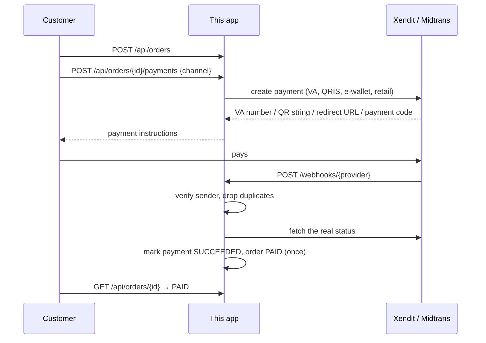

# Payment Gateway Starter

A Spring Boot backend for taking Indonesian payments (virtual accounts, QRIS, e-wallets, and retail outlets) through **Xendit** or **Midtrans**. It handles the parts that usually go wrong in production: duplicate webhooks, forged webhooks, late payments, customers who switch payment methods, and payments that expire.

Customers sign in with **Google** (Firebase Authentication); sessions live in **Redis** (Upstash), and checkout, the payment page, and order history require a session.

It runs with zero setup: a built-in **simulator** gateway stands in for the real ones and a dev sign-in stands in for Google, so you can click through the whole checkout before you have any keys.

The storefront and admin dashboard live in a separate repo: **[payment-gateway-starter-web](https://github.com/Mauludinegi/payment-gateway-starter-web)** (Nuxt 4 + Nuxt UI).

<table>
  <tr>
    <td></td>
    <td></td>
  </tr>
</table>

## Quick start

Requires Java 21+.

```bash
./mvnw spring-boot:run
```

The API is on http://localhost:8080. For the store and admin UI, run the [web app](https://github.com/Mauludinegi/payment-gateway-starter-web) next to it, or try the API directly:

```bash
AUTH="authorization: Bearer $(curl -s localhost:8080/api/auth/dev -H 'content-type: application/json' \
  -d '{"name":"Budi","email":"budi@example.com"}' | jq -r .token)"
ORDER=$(curl -s localhost:8080/api/orders -H "$AUTH" -H 'content-type: application/json' \
  -d '{"items":[{"productId":"course-k8s","quantity":1}]}' | jq -r .id)
curl -s localhost:8080/api/orders/$ORDER/payments -H "$AUTH" -H 'content-type: application/json' -d '{"channel":"BCA_VA"}'
curl -s -X POST localhost:8080/api/simulator/orders/$ORDER/pay      # the simulator sends a signed webhook
curl -s localhost:8080/api/orders/$ORDER -H "$AUTH" | jq .status   # "PAID"
```

With your own services (Postgres such as Supabase, Upstash Redis, Firebase), put them in `.env` and run with the `local` profile, which reads that file:

```bash
cp .env.example .env   # fill in what you use
./mvnw spring-boot:run -Dspring-boot.run.profiles=local
```

Or run PostgreSQL in Docker:

```bash
docker compose up --build
```

### Accounts and sessions

1. The web app signs the customer in with Google through Firebase and sends the Firebase ID token to `POST /api/auth/google`.
2. The backend verifies the token against Google's public keys (RS256, audience and issuer bound to `FIREBASE_PROJECT_ID`, not expired). No service account is needed.
3. It creates or updates the user and returns an opaque session token. Redis stores only the token's SHA-256 with a TTL (`AUTH_SESSION_TTL`, 7 days by default), so a Redis dump cannot be replayed as a login.
4. Customer endpoints take `Authorization: Bearer <session>`. Customers see only their own orders; someone else's order returns `404`.

Without `UPSTASH_REDIS_REST_URL`, sessions are kept in memory (single instance, lost on restart). `POST /api/auth/dev` signs in with just a name and email for local runs; it is on by default and must be turned off with `AUTH_DEV_LOGIN_ENABLED=false` in production.

**Supabase:** use the session pooler (`aws-0-<region>.pooler.supabase.com:5432`, user `postgres.<project-ref>`), because the direct `db.<ref>.supabase.co` host is IPv6-only. Set `DATABASE_SCHEMA=payments` so the tables are not in `public`, which Supabase exposes through its Data API.

## What it does



### Channels

| Kind | Xendit | Midtrans |
| --- | --- | --- |
| Virtual account | BCA, BNI, BRI, Mandiri, Permata, BSI | BCA, BNI, BRI, Mandiri, Permata |
| QR | QRIS | QRIS |
| E-wallet | OVO, DANA, ShopeePay, LinkAja | GoPay, ShopeePay |
| Retail outlet | Indomaret, Alfamart | Indomaret, Alfamart |

Each channel goes to the default provider unless you route it somewhere else, so you can mix gateways:

```yaml
payments:
  default-provider: XENDIT
  routing:
    GOPAY: MIDTRANS
```

### API

| Method | Path | Notes |
| --- | --- | --- |
| `GET` | `/api/products` | Active products from the catalogue |
| `GET` | `/api/channels` | Channels whose gateway is configured |
| `GET` | `/api/auth/options` | Which sign-in methods are enabled |
| `POST` | `/api/auth/google` | `{idToken}` from Firebase; returns `{token, expiresAt, user}` |
| `POST` | `/api/auth/dev` | `{name, email}`; local runs only |
| `GET` | `/api/auth/me` | Signed-in user (session) |
| `DELETE` | `/api/auth/session` | Sign out; revokes the session |
| `POST` | `/api/orders` | `{items: [{productId, quantity}], customerName?}` (session); prices come from the catalogue, the receipt email from the account |
| `GET` | `/api/orders/{id}` | Order with items, its latest payment, and instructions (session) |
| `POST` | `/api/orders/{id}/payments` | `{channel, mobileNumber?}` (session); `mobileNumber` (`+62…`) is required for OVO |
| `GET` | `/api/me/orders` | The customer's 50 latest orders (session) |
| `POST` | `/webhooks/{xendit\|midtrans}` | Gateway notifications |
| `POST` | `/api/simulator/orders/{id}/{pay\|fail\|expire}` | Simulator only; disable in production |

(session) needs `Authorization: Bearer <session token>`.

Admin endpoints need `Authorization: Bearer $ADMIN_TOKEN`:

| Method | Path | Notes |
| --- | --- | --- |
| `GET` | `/api/admin/stats` | Revenue, conversion, last 7 days, payments by method, orders paid twice |
| `GET` | `/api/admin/orders?status=&q=&page=&size=` | Search by reference, name, or email |
| `GET` | `/api/admin/orders/{id}` | Items, every payment attempt, and its webhooks |
| `GET` | `/api/admin/webhooks?page=&size=` | Every processed event with the confirmed status and outcome |
| `POST` | `/api/admin/payments/{id}/sync` | Re-check one payment with its gateway, for a missed webhook |

Errors are returned as [RFC 9457](https://www.rfc-editor.org/rfc/rfc9457) problem details (`404`, `400`, `409` for an order that is already paid or expired, `401` for a missing session or a webhook that fails verification, `502` when the gateway rejects a request).

## Design decisions

- **Webhooks are verified, deduplicated, and re-checked.** Xendit webhooks must carry the account's `x-callback-token`; Midtrans notifications must carry a valid SHA-512 `signature_key`. Each event is stored in `webhook_events` under a unique `(provider, event_key)`, so a retried delivery is acknowledged without being applied twice. The payload is then treated only as a hint: the app asks the gateway for the payment's current status and applies that.
- **Statuses only move forward.** A succeeded payment is never downgraded by a late `failed` or `expired` event, and a final status is never overwritten. The order becomes `PAID` exactly once, and `OrderPaidEvent` is published once, after the transaction commits (see `ReceiptNotifier` for where to send receipts or fulfil the order).
- **Late payments still count.** If a customer switches from a VA to QRIS but then pays the old VA anyway, the money arrived, so the order is marked paid.
- **Switching methods cancels the old one.** Starting a new payment cancels any pending attempt at the gateway first (best effort), so customers don't end up with two live payment codes.
- **Expiry is double-checked.** A scheduled job closes payments past their expiry (with a 2-minute grace period) only after confirming with the gateway that they were not paid at the last second. Orders expire after 24 hours by default; each payment after 1 hour.
- **Concurrency.** Entities use optimistic locking (`@Version`), so a webhook and the expiry job racing on the same payment cannot both win. Requests run on virtual threads.
- **The server prices every order.** The client sends product IDs and quantities only; names and prices are copied into `order_items`, so later catalogue edits never change a placed order.
- **Double payments are visible.** If an old method is paid after the customer switched and paid the new one, the order stays paid once and the admin API flags it for a refund.
- **Gateways sit behind one interface.** `PaymentGateway` has `create`, `fetchStatus`, `cancel`, and `parseWebhook`. Adding another provider means one new class; checkout and webhook handling stay the same.

## Connecting a real gateway

Webhooks need a public URL. For local testing, expose port 8080 with a tunnel such as `cloudflared tunnel --url http://localhost:8080` or `ngrok http 8080`.

### Xendit (test mode)

1. In the Xendit dashboard (test mode), copy the secret API key and the webhook verification token.
2. Set `XENDIT_SECRET_KEY`, `XENDIT_CALLBACK_TOKEN`, and `PAYMENTS_DEFAULT_PROVIDER=XENDIT`.
3. Under webhook settings, point the Payments API notifications (`payment.capture`, `payment.failure`) to `https://<your-host>/webhooks/xendit`.

This uses the [Payments API v3](https://docs.xendit.co/apidocs/create-payment-request) (`POST /v3/payment_requests`). Required `channel_properties` vary by channel and change over time, so check them in Xendit's Channel Data Finder; they are built in `XenditGateway.channelProperties`.

### Midtrans (sandbox)

1. In the Midtrans sandbox dashboard, copy the server key.
2. Set `MIDTRANS_SERVER_KEY` and `PAYMENTS_DEFAULT_PROVIDER=MIDTRANS` (or route individual channels to `MIDTRANS`).
3. Set the payment notification URL to `https://<your-host>/webhooks/midtrans`.

This uses the [Core API](https://docs.midtrans.com/reference/charge-transactions-1) (`POST /v2/charge`). For production, set `MIDTRANS_BASE_URL=https://api.midtrans.com`.

### Before going live

- Set `PAYMENTS_SIMULATOR_ENABLED=false`.
- Set a long random `ADMIN_TOKEN`; without it the admin API accepts the demo token and logs a warning.
- Set `PAYMENTS_RETURN_URL` to your web app's order page, e.g. `https://shop.example.com/orders/{orderId}`.
- Set `AUTH_DEV_LOGIN_ENABLED=false`, `FIREBASE_PROJECT_ID`, and the Upstash variables so sessions survive restarts and are shared between instances.
- In the Firebase console, enable Google under Authentication > Sign-in method and add your web domain to the authorised domains.
- Use PostgreSQL (`DATABASE_URL`, `DATABASE_USERNAME`, `DATABASE_PASSWORD`, optionally `DATABASE_SCHEMA`). The schema is managed by Flyway.

## Tests

```bash
./mvnw verify
```

- `PaymentStatusServiceTest`: status rules (paid once, no downgrades, late payments).
- `XenditGatewayTest`, `MidtransGatewayTest`: request bodies, status mapping, and webhook verification against mocked HTTP.
- `CheckoutFlowTest`: the full flow over HTTP with the simulator, including server-side pricing, duplicate and forged webhooks, and switching methods.
- `AdminApiTest`: token check, search and filters, orders paid twice flagged for refund, and re-checking a payment whose webhook was missed.
- `AuthApiTest`: endpoints that need a session, customers seeing only their own orders, repeat sign-ins, and sign-out revoking the session.
- `FirebaseTokenVerifierTest`: Google ID tokens with a wrong project, an expired time, or a foreign signing key are rejected.
- `UpstashSessionStoreTest`: the Redis REST commands and error handling.

## Stack

Java 21, Spring Boot 4, Spring Data JPA, Flyway, PostgreSQL (H2 for local runs and tests), Redis (Upstash REST), Firebase Authentication (Nimbus JOSE + JWT), Docker, GitHub Actions.

## License

MIT
